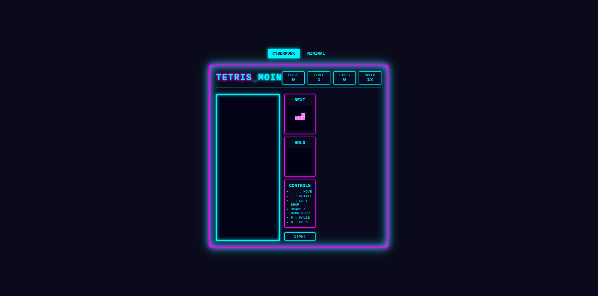
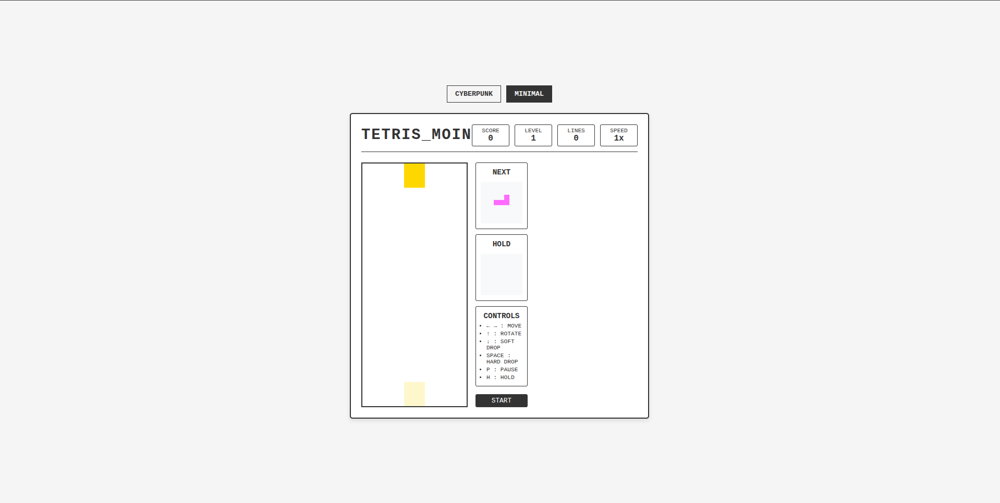

Here's the complete `README.md` with all sections filled out:

# Advanced Tetris with Dual Themes

 


A modern Tetris implementation featuring two distinct visual themes (Cyberpunk and Minimalist) with advanced gameplay mechanics. Built with pure HTML, CSS, and JavaScript.

## Features

### 🎮 Core Gameplay
- Classic Tetris mechanics with all 7 tetromino pieces
- Score tracking with progressive scoring system
- Level progression that increases game speed
- Line clearing with visual effects
- Game over detection

### 🎨 Dual Visual Themes
1. **Cyberpunk Theme**:
   - Neon color scheme with glowing effects
   - Dark interface with vibrant accents
   - Animated game states (pause, game over)
   - Glowing piece shadows

2. **Minimalist Theme**:
   - Clean, light interface
   - Simple color palette
   - Subtle animations
   - Reduced visual noise

### ⚡ Advanced Mechanics
- **Hold piece** functionality (press H)
- **Ghost piece** preview showing landing position
- **Wall kicks** for better rotation mechanics
- **Progressive difficulty** with speed increases
- **Garbage lines** added at higher levels for challenge

### 📊 Game Statistics
- Current score display
- Level indicator
- Lines cleared counter
- Speed multiplier display

### 🎛️ Controls
- **← →** : Move left/right
- **↑** : Rotate piece
- **↓** : Soft drop (accelerate downward)
- **Space** : Hard drop (instant placement)
- **P** : Pause game
- **H** : Hold current piece

## Installation

1. Clone the repository:
   ```bash
   git clone https://github.com/your-username/advanced-tetris.git
   ```
2. Navigate to the project directory:
   ```bash
   cd advanced-tetris
   ```
3. Open `index.html` in your browser:
   - Double-click the file, or
   - Use a local server like Live Server in VS Code

## How to Play

### Basic Rules
- Arrange falling tetrominoes to complete horizontal lines
- Completed lines disappear and award points
- Game speeds up as you level up
- Game ends when pieces stack to the top

### Theme Switching
Click the theme buttons at the top to instantly switch between:
- Cyberpunk (dark, neon)
- Minimalist (light, clean)

### Scoring System
| Lines Cleared | Base Points | Level Multiplier |
|--------------|------------|-----------------|
| 1            | 40         | × current level |
| 2            | 100        | × current level |
| 3            | 300        | × current level |
| 4 (Tetris!)  | 1200       | × current level |

Level increases every 5 lines cleared.

## Development

### Project Structure
```
advanced-tetris/
├── index.html        # Main HTML file
├── styles_MOIN.css   # All CSS styles
├── script_MOIN.js    # Game logic
└── assets/           # (Optional) For images/fonts
```

### Building
No build step required - works directly in browser.

### Customization
To modify the game:
1. Edit `styles_MOIN.css` for visual changes
2. Modify `script_MOIN.js` for gameplay changes
3. Adjust colors in the THEMES_MOIN object in JavaScript

## Troubleshooting

**Problem**: Game doesn't load
- Solution: Check browser console for errors (F12)

**Problem**: Controls not working
- Solution: Ensure no other apps are using the same keyboard shortcuts

**Problem**: Visual glitches
- Solution: Clear browser cache or try another browser

## Contributing

Contributions welcome! Please:
1. Fork the repository
2. Create a feature branch
3. Commit your changes
4. Push to the branch
5. Open a pull request

## License

MIT License - See [LICENSE](LICENSE) file for details.

---

**Enjoy the game!** 🎮 Try to beat your high score!
